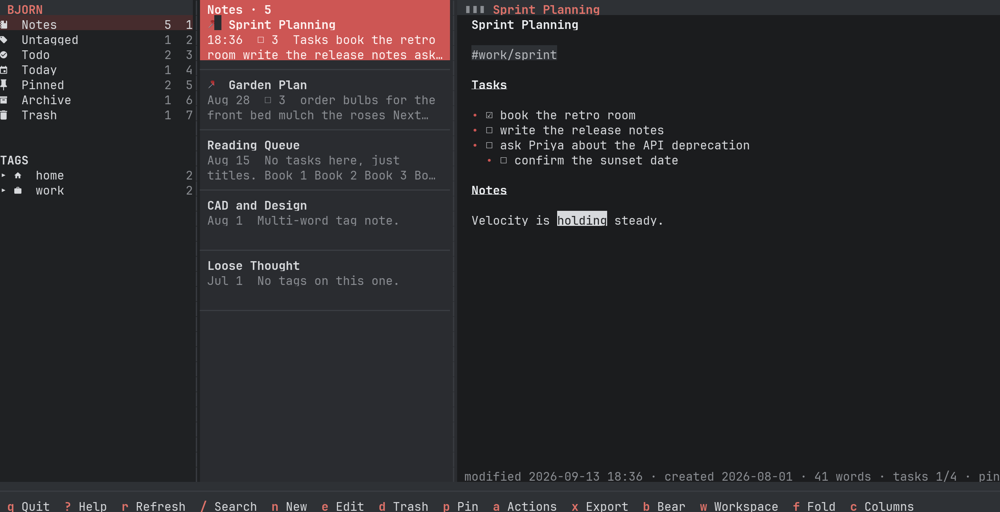
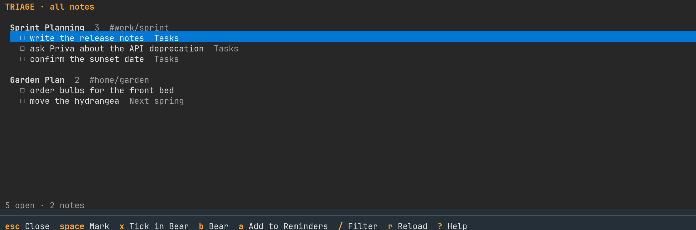

# Bjorn

A terminal front end for [Bear](https://bear.app), written in Rust with
[ratatui](https://ratatui.rs). Everything goes through `bearcli`, the command
line tool that ships inside Bear.app, so Bjorn works with Bear open or closed
and never touches the database directly.



Three columns, like the app: smart views and a nested tag tree on the left,
the notes list in the middle, the rendered note on the right. Editing is
delegated to `$VISUAL`, then `$EDITOR`, then `vim`, which runs in a
pseudo-terminal drawn inside the reader pane so the other columns stay up;
writes back are hash-guarded, so if the note changed in Bear while you were
editing, nothing is written and your version is kept in a temp file. Search
uses Bear's syntax through `bearcli search`, with operator and tag completion
in the box and match highlighting in the reader. `t` opens todo triage, with
Apple Reminders through `remctl` when enabled.

## Install

Requires macOS with Bear installed and a Rust toolchain (`brew install rustup
&& rustup default stable`). Bjorn finds `bearcli` on `PATH` or inside
`/Applications/Bear.app`; set `bearcli = "..."` in the config for anywhere else.

```sh
git clone https://github.com/7robots/bjorn.git
cd bjorn
./install.sh          # builds --release, puts a `bjorn` launcher in ~/bin
bjorn                 # or: cargo run --release --bin bjorn
bjorn --tag work      # start scoped to a tag subtree
bjorn --demo          # sample notes through the built-in fake bearcli, no Bear needed
bjorn capture "call Ana"   # add a line to today's daily note, no TUI
```

`git pull && ./install.sh` is the update path.

## Keys

| Key | Action | Key | Action |
|---|---|---|---|
| `tab` / `shift+tab` | cycle panes | `/` | search (Bear syntax); `@` and `#` complete, `tab` or `→` accepts; `enter` runs it |
| `j` `k` `↑` `↓` | move within a pane; in the sidebar the cursor runs from the views into the tags; in the reader they scroll | `esc` | clear the search and its highlights |
| `enter` | move into the reader for the highlighted note, at the first match while searching | `1`–`7` | Notes, Untagged, Todo, Today, Pinned, Archive, Trash |
| `n` | new note (title, tags), then edit | `d` | move the note to the trash, after a confirm |
| `D` | today's daily note, made from the daily template the first time (see [Daily notes and templates](#daily-notes-and-templates)) | `N` | new note from a template: pick one, then title and tags as for `n` |
| `e` | edit in `$VISUAL` / `$EDITOR` | `u` | restore from Trash or Archive |
| `p` | toggle the global pin | `x` | export: Markdown, HTML, text, RTF, TextBundle (`←` `→` pick, `enter` confirms) |
| `b` | open in Bear.app | `!` / `a` | run the default action / open the action menu (see [Actions](#actions)) |
| `w` | make the highlighted tag the workspace; again on it to leave | `W` | clear the workspace |
| `f` | fold / unfold the highlighted tag's subtree | `F` | fold every tag, or unfold them all when all are folded |
| `t` | triage the workspace's open todos | `c` / click `▮▮▮` | hide the tag column, then the note column too, then show all three |
| `]` / `[` | next / previous match in the reader while searching | `r` | refresh now |
| `o` | outline: the note's headings, indented by level; type to filter, `enter` scrolls there | `}` / `{` | next / previous heading in the reader |
| `?` | help (`esc` `q` `?` close it) | `q` | quit, after a confirm |

The **workspace** is a tag subtree that scopes the whole app: the tag tree
shows only it, the smart views count only inside it, search results are
filtered to it, and new notes default to it.

Search goes to `bearcli search` unchanged, so Bear's whole syntax works and
plain terms match body text, not just titles. While you type, `@` completes
bearcli's operators (`@todo`, `@title`, `@last7days`, `@date(`…) and `#`
completes your tags, workspace first, as ghost text that `tab` or `→`
accepts; a one-line cheat sheet sits under the box. Bear matches `#name`
against full tag paths only, so a bare sub-tag (`#Build` for
`#kybernetes/Build`) is completed and searched as `#*/Build`, Bear's
sub-tag form. `enter` runs the search and moves to the results; the box
stays open with the query, dimmed until you press `/` or click it to edit
again. While a search is active the reader highlights the terms, including
inside fenced code and table cells, the header counts the matching blocks,
`]` and `[` step through them, and `enter` on a note lands on its first match.

`o` lists the headings of the note in the reader, indented by level, with the
section you are reading highlighted; typing filters them and `enter` scrolls
that heading to the top of the reader. `}` and `{` step to the next and
previous heading without the list, and the line under the reader names the
section at the top of the view. Headings come from the same parse that draws
the note, so a `#` line inside fenced code is never one.

Views are computed from one `bearcli list` snapshot, so the counts in the
sidebar and the notes list always agree. **Pinned** means any pin, global or
inside a tag. **Today** means modified today, local time.

The reader renders the whole note in one pass and draws only the viewport, so
a 100 KB note shows as fast as a short one. It does not wait for a note it
already has: the cursor's neighbours are read ahead, a cold start keeps the
bodies the preview listing had to read anyway, and only a body that has to
come from bearcli waits out a 120 ms debounce. Holding `j` down scrolls the
reader with the list. Every `bearcli` and `remctl` call has a 30 s timeout.

## Todo triage

`t` opens a screen listing every open `- [ ]` item from the `@todo` notes in
the workspace (all notes when none is set), grouped by note with the section
each item sits under. `space` marks rows, `x` ticks the marked (or highlighted)
items in Bear through `bearcli edit`, `enter` jumps to the note, `b` opens it
in Bear.app at that section, `/` filters, `r` reloads, `esc` or `q` closes.



With `[reminders] enabled = true` and [remctl](https://github.com/7robots/remctl)
on your PATH, `a` also pushes marked items to Apple Reminders. Each reminder's
notes carry the note's `bear://` link and a `bear-todo: <key>` line (the same
scheme remtui uses, so reminders it created are recognised); on every load
they are read back and rows show ⏰ for an open reminder or ✓ for one you
completed in Reminders, ready to `x` in Bear. Nothing is written into Bear when
a reminder is added.

## Daily notes and templates

`D` opens today's note, making it the first time. By default it is titled
with the date as a second-level heading and tagged with a dated nested tag:

```markdown
## September 19, 2026 (Saturday)
#log/2026/09/19
* People:
* Topic:

---
```

The note is found by its title: `D` selects it when the snapshot already
has it, and otherwise calls `bearcli create --if-not-exists -- "<title>"`,
which returns the existing note or makes one from the daily template. Asking
twice from Bjorn never makes a second note; two processes asking in the same
instant could, and the duplicate-title warning would then say so. Bear reads
the `## ` first line as the title and keeps it as written. If the note sits
outside the workspace, the workspace is cleared to show it. A trashed or
archived note with today's title is never reused; Bear makes a fresh one.

Because the title is the only link, `[daily] title` must name exactly one
day: a year with a month and day (`%Y-%m-%d`), a year and day of the year
(`%Y-%j`), or an ISO week date (`%G-W%V-%u`), and no time of day. A title
that repeats (`%A`, `%B %-d`) would quietly reuse last week's or last year's
note, so Bjorn refuses it at start with an error naming the key.

Capture from anywhere without opening the app:

```sh
bjorn capture "call Ana about the budget"   # the words, joined with spaces
pbpaste | bjorn capture                     # or stdin when there are none (up to 1 MiB)
bjorn capture -- "$text"                    # text that may start with a dash
bjorn --demo capture "try it"               # flags go before the subcommand
bjorn today                                 # prints: <id><TAB><title>
```

`capture` adds `* 14:05 call Ana about the budget` at the end of today's
note, making the note first if needed. It prints nothing on success and
exits non-zero with the reason on stderr otherwise: blank text, over 1 MiB
on stdin, or an unknown flag. Control characters other than tab and newline
are dropped from the text. `--config`, `--demo` and `--tag` belong before
`capture` or `today`; after the subcommand any word starting with `-` is an
error rather than text, so a script passing arbitrary text (a commit message
from a hook, say) should write `bjorn capture -- "$text"`. Set
`capture_section = "## Inbox"` to collect captures under that heading
instead; it is matched ignoring case, and added at the end of the note the
first time. It must be a heading line (`#` to `######`, a space, a name).
`{{workspace}}` in `capture_format` is the config's `workspace`, or the tag
given with `--tag` before the subcommand.

`N` makes a note from a template: a Markdown file in the templates
directory (`[templates] dir`, default `~/.config/bjorn/templates/`). Pick
one in the search box, then settle the title and tags as for `n`. When a
template starts with a heading (after any YAML front matter, which stays on
top), its text is the proposed title, and the note keeps that heading level.
`{{date}}`, `{{time}}`, `{{date:%A}}` (any strftime format), `{{title}}`,
`{{tag}}` (the note's tags as Bear writes them) and `{{workspace}}` are
filled in; anything else in braces stays as written. Files over 256 KiB or
not UTF-8 are skipped; symlinks are followed. Meeting, 1:1, decision record
and daily examples ship in `config/templates/`:

```sh
mkdir -p ~/.config/bjorn/templates
cp config/templates/*.md ~/.config/bjorn/templates/
```

A `daily.md` there replaces the built-in daily layout (and is left out of
`N`'s list); `{{tag}}` in it is the dated tag. A `daily.md` that exists but
cannot be read is reported rather than replaced by the built-in layout.
`template` can also name another file: `sub/day` is inside the templates
directory, an absolute or `~/` path is taken as it is.

## Configuration

`~/.config/bjorn/config.toml` (or `$XDG_CONFIG_HOME/bjorn/config.toml`), or
`--config PATH`. Every key is optional:

```toml
editor = "nvim"               # overrides $VISUAL / $EDITOR
export_dir = "~/Downloads"    # where `x` proposes to write
export_format = "md"          # preselected in the export picker: md | html | txt | rtf | textbundle
poll_seconds = 5              # 0 disables the background refresh
workspace = "work"            # start scoped to this tag
bearcli = "/usr/local/bin/bearcli"  # optional; default searches PATH, then Bear.app
icon_style = "auto"           # auto | nerd | emoji | lucide | none
theme = "red-graphite-dark"   # see Themes below; `bjorn --list-themes` prints the names

[icons]                       # top-level tag -> Lucide icon name, or emoji:<glyph>
tech = "terminal"
school = "emoji:🎓"

[reminders]                   # triage can push todos to Apple Reminders
enabled = false               # off by default
list = "Bear"                 # target list; remctl's default when empty
due = "today"                 # due date for new reminders; "" for none
remctl = ""                   # path to remctl; default searches PATH

[[actions]]                   # shell commands for `!` and `a`; see Actions below

[daily]                       # `D` and `bjorn capture`; title and tag are strftime formats
title = "%B %-d, %Y (%A)"     # the note is found by this title, so it must name one day
tag = "log/%Y/%m/%d"          # "" for none; "work/log/%Y/%m/%d" keeps it in a workspace
template = "daily"            # templates/daily.md, else the built-in layout
capture_section = ""          # a heading line, e.g. "## Inbox"; "" adds at the end of the note
capture_format = "* {{time}} {{text}}"

[templates]
dir = "~/.config/bjorn/templates"
```

Every default is in [config/config.toml.example](config/config.toml.example).

`mouse_pixels` and `--no-mouse-pixels` are accepted from older config files
and ignored: the mouse always stays in cell mode.

Bjorn keeps one cache file, `~/.cache/bjorn/previews.json` (or under
`$XDG_CACHE_HOME`): the notes list's body previews, keyed by note id and
modification stamp. It is what lets a launch list metadata only instead of
reading every note's body to build the previews again. Deleting it costs one
slow start. `--demo` runs keep their own copy, so the sample library never
stands in for the real one.

The poll is cheap: two `bearcli list` probes run together and a reload only
when something changed. A reload lists metadata only and reads the body of
just the notes whose modification time moved.

### Themes

The palette comes from `theme` in the config file, or `--theme` on the
command line (`--list-themes` prints them):

| Name | |
|---|---|
| `red-graphite-dark` | the default: Bear's Red Graphite over graphite, coral red (`#CD5654`) on the focused column, the cursor, the bullets, the links and the tags |
| `red-graphite` | the same red in Bear's light Red Graphite: a graphite sidebar beside a white page |
| `textual-dark` | the original palette: a dark grey page with blue and amber accents |

Every other theme Bear ships is here too, under its Bear name in lower case
with hyphens for spaces:

> `academia` `atom` `ayu` `ayu-mirage` `catppuccin-latte`
> `catppuccin-macchiato` `charcoal` `cobalt` `d-boring` `dark-graphite`
> `dark-notes` `dieci` `dracula` `duotone-heat` `duotone-light`
> `duotone-snow` `everforest-dark` `everforest-light` `gandalf` `gotham`
> `gruvbox` `high-contrast` `lighthaus` `nord` `nord-light` `notes`
> `olive-dunk` `panic-mode` `print` `rose-pine` `rose-pine-dawn`
> `shibuya-jazz` `shibuya-lo-fi` `solarized-dark` `solarized-light`
> `tokyo-night` `tokyo-night-light` `toothpaste`

```sh
bjorn --theme nord
```

They are generated from the theme files inside Bear.app by
`tools/bear_theme.py`, which maps Bear's keys onto the app's palette fields
(page, sidebar, headers, cursor, links, code, tags). The toast colours come
from the palette a theme is named after, or from Bear's highlighter colours
for Bear's own designs; text over the accent is chosen for contrast. When a
Bear update adds a theme, `python3 tools/bear_theme.py > src/ui/palettes.rs`
picks it up. `?` inside the app lists the names and marks the one in use.

An unknown name in the config falls back to the default with a warning rather
than stopping the app. An unknown `--theme` on the command line is an error.

### Icons

Top-level tags and the smart views carry icons: Nerd Font (Material Design)
glyphs when the terminal is Ghostty or WezTerm or a Nerd Font is installed,
emoji otherwise. Built-in defaults cover common top-level tags (`work`, `home`,
`projects`, `ideas`, `journal`, `books`, `reading`, `tech`, `code`, `garden`,
`travel`, `health`, `music`, `robotics`, `school`); anything else gets a tag
glyph. Names are Lucide's (`bot`, `book-open`, `compass`, ...); see
`src/icons.rs` for the table.

`icon_style = "lucide"` draws Lucide's own glyphs from its icon font instead of
Nerd Font look-alikes, and any of Lucide's 2,000+ names works under `[icons]`.
It is opt-in because the terminal has to be told about the font:

```sh
# 1. Install the font. Pin the version Bjorn's codepoint table was built from.
curl -L -o ~/Library/Fonts/lucide.ttf https://unpkg.com/lucide-static@1.43.0/font/lucide.ttf

# 2. Ghostty: route Lucide's codepoint range to it (~/.config/ghostty/config).
font-codepoint-map = U+E038-U+E768=Lucide
```

Open a new Ghostty window afterwards. Kitty's `symbol_map` does the same job.

Two caveats. Lucide reassigns codepoints between releases, so the installed
`lucide.ttf` must match the bundled table (lucide-static 1.43.0; both are noted
in `src/icons.rs`). And U+E000–U+E7FF is where Nerd Fonts keep the
Powerline, Pomicons, Seti and Codicons sets, so that mapping takes those glyphs
away from everything in the window: prompt themes, `eza`/`lsd` file icons,
Neovim statuslines. Bjorn's Material Design glyphs live above U+F0000 and are
unaffected.

## Actions

`x` exports a note to a file you pick. `!` and `a` hand that same file to a
command of yours: publish it, copy it, POST it, push it.

```toml
# ~/.config/bjorn/config.toml
[[actions]]
name = "Publish to S3"
command = 'aws s3 cp "$BJORN_NOTE_FILE" "s3://notes/$BJORN_NOTE_TITLE.html"'
format = "html"        # md (default), html, txt, rtf, textbundle
confirm = true         # ask first
default = true         # this is what `!` runs

[[actions]]
name = "Copy as plain text"
command = "pbcopy"
format = "txt"

[[actions]]
name = "Mail it to someone"
command = 'mail -s "$BJORN_NOTE_TITLE" "$BJORN_ACTION_INPUT" < "$BJORN_NOTE_FILE"'
prompt = "Send to which address"   # asks first, answer in $BJORN_ACTION_INPUT
```

`a` opens the action menu — a search box over your actions, filtered as you
type, with the default marked ★ and the highlighted command shown in full;
`enter` runs. An action with a `prompt` asks for one line of text first and
passes it as `$BJORN_ACTION_INPUT`, which is one action rather than five
when all that changes between them is an argument. `!` skips the menu and
runs the default straight away. The menu's last row, **+ New action**, adds
one, `ctrl+e` edits the highlighted one and `ctrl+d` deletes it after
asking; all three write the config for you, comments and all. The note is
rendered the way export renders it, written to a temp file the command gets
as `$BJORN_NOTE_FILE` (and on stdin), with the title, id, tags and stamps in
the environment; the file goes away when the command ends. The first line
the command prints comes back as a toast, and a non-zero exit is reported
with its stderr. Full reference: [docs/actions.md](docs/actions.md).

## Development

```sh
cargo test                                 # unit, client, UI through a headless harness
cargo clippy --all-targets -- -D warnings
cargo run --release --bin bjorn-gate       # acceptance gate against the live library
cargo run --release --bin bjorn-gate -- --bench
cargo run --release --bin bjorn-gate -- --latency
cargo run --example shot -- --theme red-graphite --out /tmp/shot.json
uv run --with pillow --with fonttools python tools/shot.py /tmp/shot.json /tmp/shot.png
```

The screenshots above come from the same pipeline, drawn against the demo
library the fake bearcli seeds (`--height 34` for the main screen, `--screen
triage --height 22` for triage, then `tools/shot.py ... --scale 2`). A Nerd
Font in `~/Library/Fonts` is what draws the sidebar icons.

The plan and its status live in `docs/plans/bjorn-rust.md`; deferred work in
`docs/ROADMAP.md`.

## Acknowledgements

Bjorn exists because of [Shiny Frog](https://shinyfrog.net) and Bear, and
`bearcli` is what makes a terminal client possible at all. Thank you.
